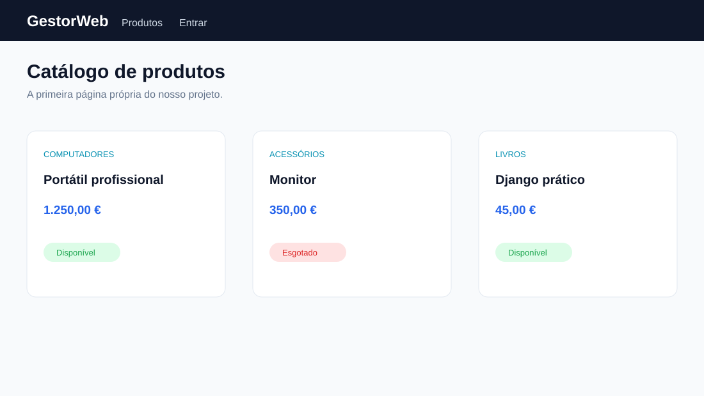
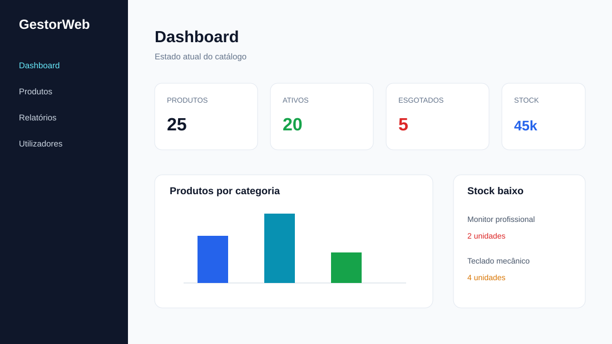
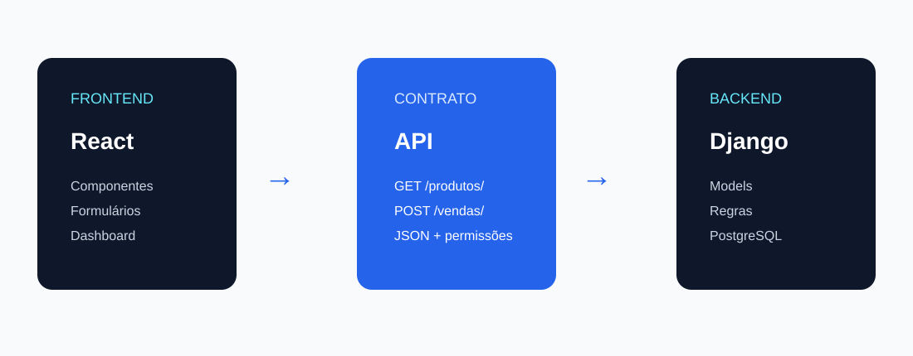
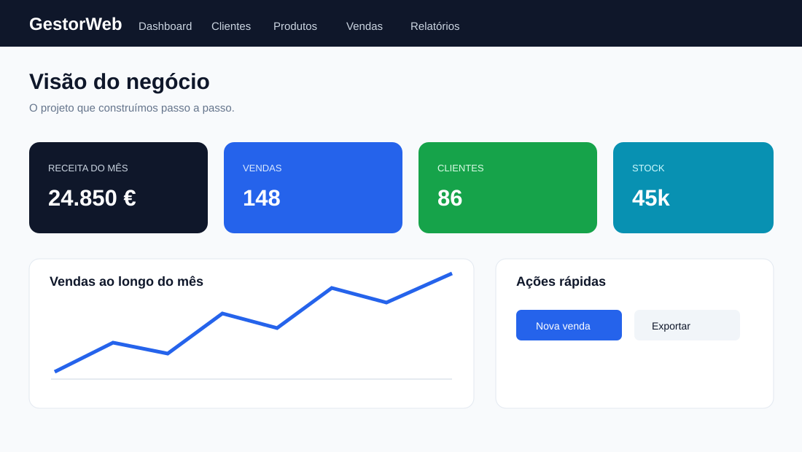

# Caderno visual da aplicação

As imagens desta pasta são **wireframes de orientação**. Elas mostram o resultado que estamos a construir antes de a aplicação estar executável. Não são screenshots de um servidor real.

## Percurso visual

### 1. Catálogo inicial

Nesta fase aprendemos models, views, templates, HTML, Bootstrap e CRUD.

### 2. Dashboard

Nesta fase aprendemos autenticação, permissões, ORM, indicadores, Excel e PDF.

### 3. API e React

Nesta fase aprendemos JSON, Django REST Framework, JavaScript e React.

### 4. Produto final

O GestorWeb junta clientes, produtos, vendas, relatórios, permissões e frontend React.

## Como usar as ilustrações

1. Antes da aula, observa o wireframe.
2. Identifica os elementos que vais construir.
3. Durante a aula, liga cada elemento ao código responsável.
4. No fim, compara o resultado real com o desenho.
5. Quando o servidor estiver pronto, substitui o wireframe por um screenshot real.

## O que ainda não é possível mostrar como screenshot

A aplicação executável ainda precisa de ser construída. Por isso, neste momento existem wireframes desenhados e exemplos de código, não screenshots reais de todas as telas. A próxima etapa prática é executar as aulas e capturar a versão real em cada marco.

---

**Elaborado por Osvaldo Queta — Engenheiro Informático desde 2015 — Programador Sénior com mais de 8 anos de experiência**
