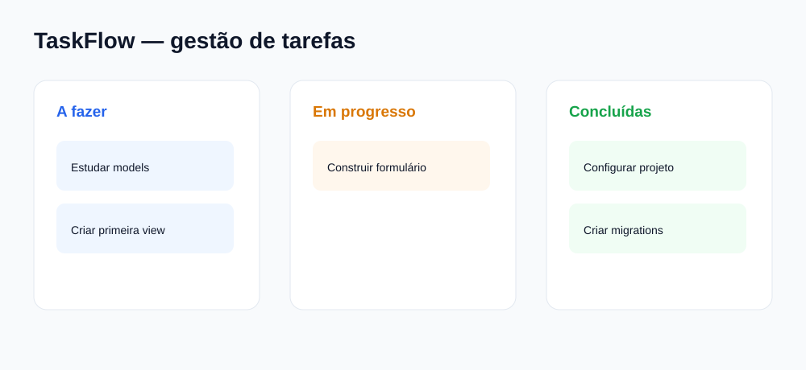

# Projeto completo 1 — TaskFlow

## O que vamos construir

Um sistema de gestão de tarefas com contas, prioridades, estados e dashboard.



## Para que serve

Este é o melhor projeto depois do catálogo porque transforma CRUD em uma ferramenta que pode ser usada todos os dias. Vais praticar relações, filtros, permissões e estados.

## Sequência do projeto

### Etapa 1 — Fundação

```bash
django-admin startproject config .
python manage.py startapp tarefas
python manage.py startapp contas
```

Models iniciais:

```python
class Tarefa(models.Model):
    titulo = models.CharField(max_length=180)
    descricao = models.TextField(blank=True)
    estado = models.CharField(max_length=20, choices=ESTADOS)
    prioridade = models.CharField(max_length=20, choices=PRIORIDADES)
    responsavel = models.ForeignKey(User, on_delete=models.CASCADE)
    prazo = models.DateField(null=True, blank=True)
```

### Etapa 2 — Páginas

- Lista de tarefas.
- Detalhe.
- Criar.
- Editar.
- Apagar.
- Filtro por estado.
- Ordenação por prazo.

### Etapa 3 — Regras

- Cada utilizador vê as suas tarefas.
- Staff pode ver todas.
- Tarefa concluída não pode ser editada por operador.
- Prazo passado aparece com alerta vermelho.

### Etapa 4 — Dashboard

- Total de tarefas.
- Pendentes.
- Em progresso.
- Concluídas.
- Atrasadas.

### Etapa 5 — API e frontend opcional

- `GET /api/tarefas/`
- `POST /api/tarefas/`
- Filtro por estado.
- React com quadro Kanban.

### Etapa 6 — Qualidade e publicação

- Testes de permissões.
- Testes de estados.
- Exportação de tarefas.
- README.
- Deploy.

## Bibliotecas

- Django.
- Bootstrap.
- Django REST Framework.
- pytest-django depois dos testes nativos.
- openpyxl para exportar tarefas.

## Exercícios

1. Criar uma tarefa.
2. Alterar o estado.
3. Filtrar apenas atrasadas.
4. Criar uma página de resumo.
5. Testar que um utilizador não vê a tarefa de outro.

## Desafio final

Adicionar comentários numa tarefa e um histórico de alterações.

## Critério de terminado

O TaskFlow está pronto quando um utilizador consegue entrar, gerir as suas tarefas, consultar o dashboard e usar a aplicação sem acesso a dados de outras contas.

---

**Elaborado por Osvaldo Queta — Engenheiro Informático desde 2015 — Programador Sénior com mais de 8 anos de experiência**
