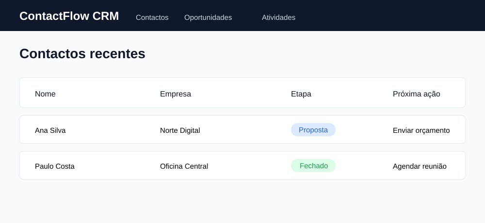

# Projeto completo 2 — ContactFlow CRM

## O que vamos construir

Um CRM simples para gerir contactos, empresas, oportunidades e próximas ações.



## Para que serve

Este projeto ensina relações entre várias entidades e aproxima o curso de um sistema usado por pequenos negócios.

## Sequência do projeto

### Etapa 1 — Modelos

```python
class Empresa(models.Model):
    nome = models.CharField(max_length=160)

class Contacto(models.Model):
    nome = models.CharField(max_length=160)
    email = models.EmailField()
    empresa = models.ForeignKey(Empresa, on_delete=models.CASCADE)

class Oportunidade(models.Model):
    contacto = models.ForeignKey(Contacto, on_delete=models.CASCADE)
    etapa = models.CharField(max_length=30, choices=ETAPAS)
    valor = models.DecimalField(max_digits=12, decimal_places=2)
```

### Etapa 2 — CRUD e pesquisa

- Empresas.
- Contactos.
- Oportunidades.
- Pesquisa por nome e email.
- Filtro por etapa.
- Ordenação por valor.

### Etapa 3 — Atividades

Criar registos de chamada, email e reunião:

```text
Contacto → Atividade → data, tipo, nota, concluída
```

### Etapa 4 — Dashboard comercial

- Oportunidades abertas.
- Valor total em pipeline.
- Oportunidades fechadas.
- Atividades para hoje.
- Conversão por etapa.

### Etapa 5 — Segurança

- Cada vendedor vê os próprios contactos.
- Gestor vê a equipa.
- Staff gere utilizadores e configurações.

### Etapa 6 — API, React e exportação

- API de contactos e oportunidades.
- Frontend com tabela e pipeline.
- Excel para exportar oportunidades.
- PDF com resumo comercial.

## Bibliotecas

- Django e Bootstrap.
- Django REST Framework.
- openpyxl.
- WeasyPrint.
- React e React Router na fase frontend.

## Exercícios

1. Criar uma empresa e contacto.
2. Registar oportunidade.
3. Alterar etapa.
4. Criar atividade para amanhã.
5. Calcular o valor do pipeline.

## Desafio final

Construir uma visão Kanban com as etapas “Novo”, “Contacto”, “Proposta” e “Fechado”.

## Critério de terminado

Um gestor deve conseguir acompanhar contactos, oportunidades e próximas ações sem depender de folhas Excel separadas.

---

**Elaborado por Osvaldo Queta — Engenheiro Informático desde 2015 — Programador Sénior com mais de 8 anos de experiência**
