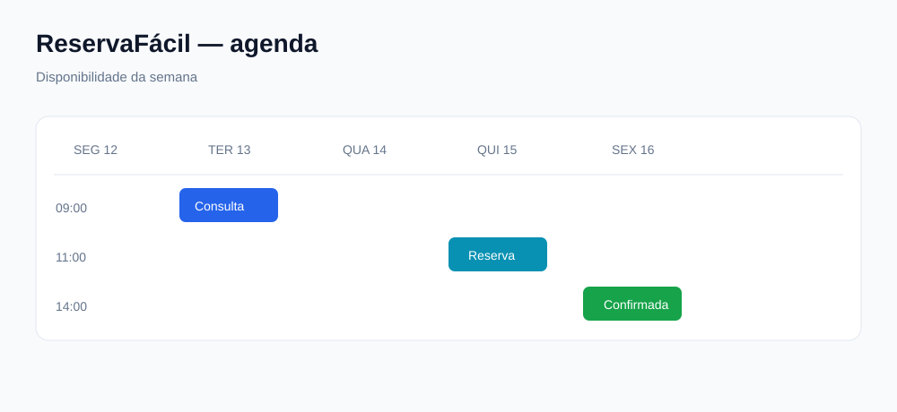

# Projeto completo 3 — ReservaFácil

## O que vamos construir

Um sistema de reservas para serviços, salas ou atendimentos.



## Para que serve

Este projeto ensina datas, horários, conflitos, estados e regras de negócio — problemas comuns em aplicações reais.

## Sequência do projeto

### Etapa 1 — Modelos

```python
class Servico(models.Model):
    nome = models.CharField(max_length=160)
    duracao_minutos = models.PositiveIntegerField()
    preco = models.DecimalField(max_digits=10, decimal_places=2)

class Reserva(models.Model):
    cliente = models.ForeignKey(Cliente, on_delete=models.PROTECT)
    servico = models.ForeignKey(Servico, on_delete=models.PROTECT)
    inicio = models.DateTimeField()
    fim = models.DateTimeField()
    estado = models.CharField(max_length=20, choices=ESTADOS)
```

### Etapa 2 — Calendário e CRUD

- Lista diária.
- Lista semanal.
- Criar reserva.
- Editar horário.
- Cancelar.
- Confirmar.

### Etapa 3 — Regra contra conflitos

Antes de guardar, procurar outra reserva que se sobreponha:

```python
conflito = Reserva.objects.filter(
    inicio__lt=novo_fim,
    fim__gt=novo_inicio,
    estado__in=["pendente", "confirmada"],
).exists()
```

Se existir conflito, o formulário deve mostrar uma mensagem clara.

### Etapa 4 — Utilizadores e notificações

- Cliente vê as próprias reservas.
- Funcionário vê a agenda.
- Gestor altera serviços.
- Email de confirmação como melhoria posterior.

### Etapa 5 — Relatórios

- Reservas por dia.
- Serviços mais procurados.
- Receita por período.
- Cancelamentos.
- Horários livres.

### Etapa 6 — API, React e publicação

- API de disponibilidade.
- Calendário React.
- Formulário de reserva.
- Testes de conflitos.
- Deploy.

## Bibliotecas

- Django timezone utilities.
- Bootstrap para o primeiro calendário visual.
- Django REST Framework.
- React para a agenda interativa.
- FullCalendar apenas depois de compreenderes a regra de negócio.

## Exercícios

1. Criar um serviço.
2. Criar uma reserva.
3. Impedir horário final anterior ao inicial.
4. Impedir reservas sobrepostas.
5. Filtrar reservas por estado.

## Desafio final

Criar uma vista semanal em que os horários ocupados aparecem com cores diferentes e uma reserva cancelada deixa de bloquear o horário.

## Critério de terminado

O sistema está pronto quando uma pessoa consegue escolher um serviço, ver disponibilidade, reservar, receber confirmação e consultar o histórico sem criar conflitos.

---

**Elaborado por Osvaldo Queta — Engenheiro Informático desde 2015 — Programador Sénior com mais de 8 anos de experiência**
